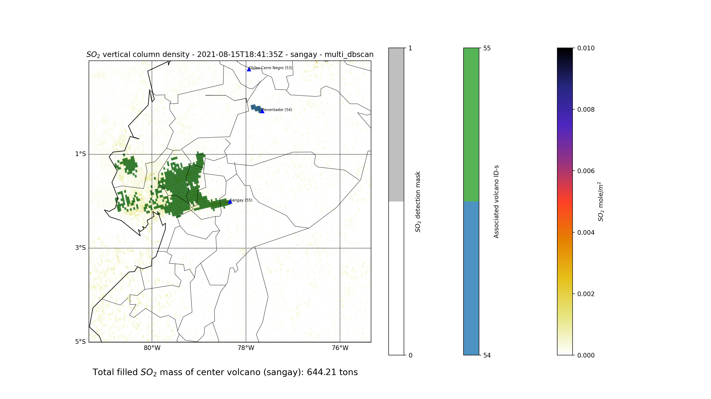

# tropomi-emission-source | Automatic Retrieval of Volcanic SO2 Emission Source from TROPOMI Products

We have developed fast and accurate SO2 plume classifier and segmentation algorithms using classic clustering, segmentation and image processing techniques. These algorithms, applied to measurements from the TROPOMI instrument onboard the Sentinel-5 Precursor platform, can help in the accurate measurement of the mass of SO2 plumes originating from various volcanoes.

This repository contains a simple script and an API which can be used to retrieve volcanic SO2 emission source and the mass of SO2 plumes from TROPOMI products.



## Getting started

In this short tutorial, we are setting up the script, and we are getting the mass of some SO2 plumes.

### Step 1

Clone this repository:

```bash
git clone https://github.com/bazsimarkus/tropomi-emission-source.git
```

### Step 2

Copy and paste the required files into the following directories, depending on which function you want to use.

```
tropomi-emission-source/assets/DATA/
tropomi-emission-source/assets/gdas/
tropomi-emission-source/assets/ground_truth/
tropomi-emission-source/assets/hysplit/
tropomi-emission-source/assets/trajectories/
```

-   DATA - the TROPOMI NRTI products have to be placed here - example filename for such a file: `S5P_NRTI_L2__SO2____20210815T184135_20210815T184635_19896_02_020201_20210815T193716.nc`
-   gdas - the GDAS meteorological files have to be placed here, as provided on the NOAA FTP server - ftp://ftp.arl.noaa.gov/pub/archives/gdas1 - no password, Port 21 - example filename: `gdas1.aug21.w3`
-   ground_truth - this folder contains the ground truth for the files in the DATA folder, in .csv format - They have to have the same file name as the .nc file, extended with ".csv" - For example: `S5P_NRTI_L2__SO2____20210815T184135_20210815T184635_19896_02_020201_20210815T193716.nc.csv` One cell represents one pixel in the product, and they have to have the same size as the product. In the cell there should be the ID of the volcano from the volcano_coordinates.csv file, and if there is no pixel, it should be left empty.
-   hysplit - the compiled HYSPLIT distribution for Linux has to be placed here
-   trajectories - this folder is used by HYSPLIT, and it can be left empty. The generated trajectories are saved here.

If you are aiming for the minimum working example, and only want to use the algorithms without wind models, it is enough to just copy and paste the TROPOMI products into the DATA folder. The other folders can be left empty, but in this case the algorithms with wind cannot be used (if you try to use them, the script will fail).

### Step 3

Install the dependencies based on the **requirements.txt** file. It may be needed to install these additional dependencies first:

```bash
sudo apt-get update 
sudo apt-get install libgfortran5
sudo apt-get install libgeos++-dev
sudo apt-get install libgeos-dev
sudo apt-get install libproj-dev
sudo apt-get install python3 python3-dev build-essential libssl-dev libffi-dev libxml2-dev libxslt1-dev zlib1g-dev python-pip
sudo apt-get install ffmpeg libsm6 libxext6  -y
pip3 install proj
pip3 install geos
pip3 install basemap
pip3 install "uvicorn[standard]"
```

### Step 4

Define the links between the files and the volcanoes and dates in the **CONFIG_TROPOMI_file_archive.csv** file. With this in the script you only have to provide the volcano and the date, and the corresponding file will be opened automatically. This step is essential, as one image can contain multiple volcanoes.
The first column contains the name of the volcano, the second column contains the date in YYYY-MM-DD format, and the third column contains the relative path of the product in the assets folder.

Example content of the **CONFIG_TROPOMI_file_archive.csv** file:

```
name,date,filepath
sangay,2021-08-15,/DATA/S5P_NRTI_L2__SO2____20210815T184135_20210815T184635_19896_02_020201_20210815T193716.nc
etna,2021-06-17,/DATA/S5P_NRTI_L2__SO2____20210617T121026_20210617T121526_19055_01_020104_20210617T130549.nc
```


### Step 5

Define the volcanoes to analyze, and the used methods in the **CONFIG_INPUT_LIST.csv** file:
The first column contains the name of the volcano, the second column contains the date in YYYY-MM-DD format, and the third column contains the name of the desired algorithm to determine the SO2 mass.
Pay attention to the correct names and the date format, otherwise the script might fail.

Example content of the **CONFIG_INPUT_LIST.csv** file:

```
name,date,method
sangay,2021-08-15,dbscan_withwind
etna,2021-06-17,floodfill_withwind
```

Available algorithms to choose from in the third column:

```
radius_100km
floodfill
floodfill_withwind
dbscan
dbscan_withwind
reverse_trajectory_dbscan
multi_dbscan
multi_reverse_trajectory_dbscan
```

### Step 6

It may happen that the PySPLIT library source code contains the HYSPLIT Windows path hardcoded. If you want to use the algorithms with wind under Linux, you might have to edit the **trajectory_generator.py** file of PySPLIT at the top of the file to contain the following (notice the path of the executable). For this you might have to copy and paste the whole library next to the the **main.py** file in a folder called "pysplit", so that you can edit its files.

```python
from CONFIG_PARAMETERS import ASSETS_DIRECTORY

def generate_bulktraj(basename, hysplit_working, output_dir, meteo_dir, years,
                      months, hours, altitudes, coordinates, run,
                      meteoyr_2digits=True, outputyr_2digits=False,
                      monthslice=slice(0, 32, 1), meteo_bookends=([4, 5], [1]),
                      get_reverse=False, get_clipped=False,
                      hysplit=ASSETS_DIRECTORY + "/hysplit/exec/hyts_std"):
```

### Step 7

After these steps, you can finally run the script:

```bash
cd tropomi-emission-source
python3 main.py
```

The script produces two kinds of outputs while running:

- a graphical plot of the scenario with the filling mask overlay in PNG format, in the *plots* folder
- a CSV/JSON response of the segmentation with the total SO2 mass, and the segmentation metrics (if available), in the *output* folder

These output objects can be queried one-by-one, too, without a need for a pre-defined list, with the help of the API. More on that in the chapter "Using the API".

## Using the API

Follow the "Getting started" steps until Step 4.

After setting up everything we can start the server for the API:

```bash
cd tropomi-emission-source
python3 -m uvicorn app:app --reload
```

After that, it should look like this:

```
INFO:     Will watch for changes in these directories: ['/home/user/tropomi-emission-source']
INFO:     Uvicorn running on http://127.0.0.1:8000 (Press CTRL+C to quit)
INFO:     Started reloader process [36006] using watchgod
INFO:     Started server process [36008]
INFO:     Waiting for application startup.
INFO:     Application startup complete.
```

Open up a web browser with the mentioned web address: http://127.0.0.1:8000/docs

With the Swagger UI the different API endpoints can be explored. Just click the "Try it out button" on the endpoint. Some examples can be found below.

### API Endpoint examples

There are always three input parameters, the name (sabancaya), the date (2021-01-04), and the method (dbscan_withwind). Pay attention to the correct format, otherwise the script fails.

#### /return_so2_mass_of_volcano

Calling this endpoint:

```
curl -X 'GET' \
  'http://127.0.0.1:8000/return_so2_mass_of_volcano?volcano_name=sangay&volcano_date=2021-08-15&method=floodfill' \
  -H 'accept: application/json'
```

Returns the mass of the SO2 plumes originating from the selected volcano.

#### /plot_so2_mass_of_volcano

*Return plots (as a .png image)*

Calling this endpoint from a web browser:

```
curl -X 'GET' \
  'http://127.0.0.1:8000/plot_so2_mass_of_volcano?volcano_name=sangay&volcano_date=2021-08-15&method=dbscan' \
  -H 'accept: */*'
```

Returns a .png image plot of the SO2 plumes originating from the selected volcano.
